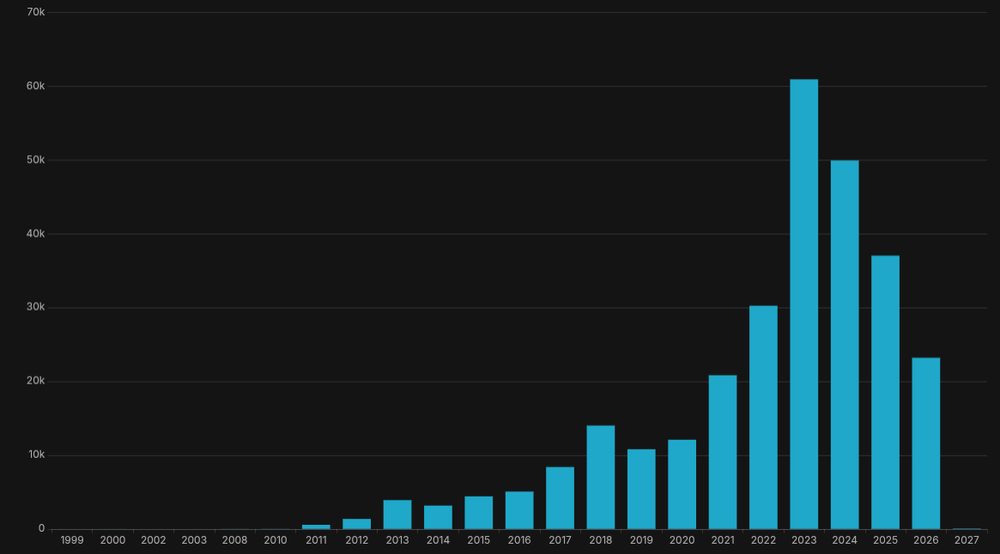
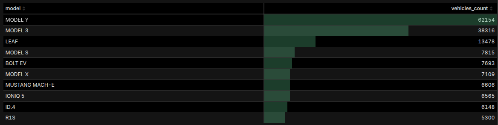
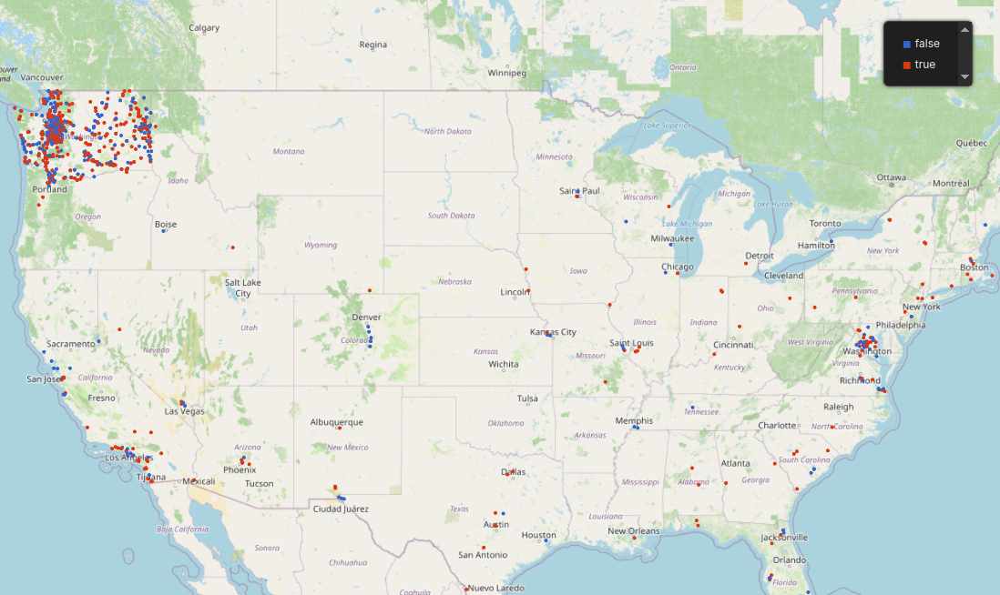
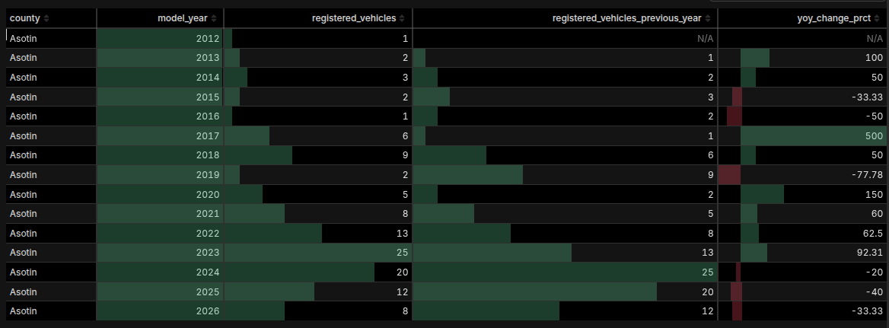

# Electric Vehicle Population Data Pipeline

End-to-end ELT pipeline that ingests Washington State's Electric Vehicle Population dataset, loads it into PostgreSQL, and transforms it with dbt to answer four analytical questions.

Stack used:

- Docker.
- Postgres (store data model).
- Superset (visualization tool).
- Apache Airflow (orchestration).
- DBeaver for EDA.
- Python + dbt for ELT.
- Gemini + Claude as domain consultants to fill knowledge gaps during development, troubleshooting Docker issues and wirting documentation.

---

## Architecture

```text
[Washington State Open Data API]
            │
            │  HTTP download (CSV)
            ▼
    ┌───────────────┐
    │  extract.py   │  Downloads raw CSV
    └───────┬───────┘
            │
            ▼
    ┌───────────────┐
    │   load.py     │  Loads CSV → PostgreSQL (Bronze)
    └───────┬───────┘
            │
            ▼
┌─────────────────────────┐
│  dbt (Staging / Silver) │  Renames columns, parses geometry,
│  electrical_vehicles_   │  converts CAFV eligibility to boolean
│  silver                 │
└────────────┬────────────┘
             │
     ┌───────┴────────┐
     │  dbt (Marts)   │
     ├────────────────┤
     │  • electrical_vehicles_per_year          (Q1)
     │  • top_10_electrical_vehicles_           (Q2)
     │    registration_count
     │  • vehicle_location                      (Q3)
     │  • yoy_change                            (Q4)
     └────────────────┘

Orchestrated by Apache Airflow 3 (Docker, standalone mode)
Visualised with Apache Superset (Docker)
```

---

## Project Structure

```text
Promtior_Challenge/
├── .env                        # Environment variables
├── docker-compose.yml          # PostgreSQL + Airflow + Superset services
├── Dockerfile.superset         # Custom Superset image
├── superset_config.py          # Superset config (SQLite metadata DB)
├── profiles.yml                # dbt profile for Docker (host: postgres)
├── start.sh                    # One-command setup: venv + docker compose up
├── requirements.txt            # Full Python dependency list
├── dags/
│   └── electric_vehicles_pipeline.py  # Airflow DAG definition
├── src/
│   ├── extract/
│   │   └── extract.py          # Download CSV from API
│   ├── load/
│   │   └── load.py             # Load CSV into PostgreSQL
│   └── superset_automation/
│       └── superset_automation.py  # Create Superset datasets and charts
├── electric_vehicles/          # dbt project
│   ├── dbt_project.yml
│   ├── packages.yml
│   ├── package-lock.yml            # dbt dependency lock file (generated by dbt deps)
│   ├── models/
│   │   ├── sources.yml         # Bronze source declaration
│   │   ├── staging/
│   │   │   └── electrical_vehicles_silver.sql
│   │   └── marts/
│   │       ├── electrical_vehicles_per_year.sql
│   │       ├── top_10_electrical_vehicles_registration_count.sql
│   │       ├── vehicle_location.sql
│   │       └── yoy_change.sql
│   └── dbt_packages/           # Installed via dbt deps
└── data/
    └── data.csv                # Downloaded by extract step
```

---

### Medallion layers

| Layer  | Table/View                     | Description                       |
| ------ | ------------------------------ | --------------------------------- |
| Bronze | `electrical_vehicles_bronze` | Raw CSV loaded as-is              |
| Silver | `electrical_vehicles_silver` | Cleaned, renamed, geometry parsed |
| Marts  | Four views (see below)         | One view per analytical question  |

---

## Prerequisites

| Tool                    | Version    | Purpose                        |
| ----------------------- | ---------- | ------------------------------ |
| Python                  | 3.11+      | Local venv for development     |
| `uv`                  | Latest     | Fast venv and package installs |
| Docker & Docker Compose | Any recent | Runs all services              |

Install `uv`:

```bash
curl -LsSf https://astral.sh/uv/install.sh | sh
```

---

## Setup

### 1. Clone the repository

```bash
git clone git@github.com:JoacoAnun/Promtior_Challenge.git
cd Promtior_Challenge
```

### 2. Configure environment variables

The `.env` file is committed intentionally for this challenge:

```env
URL="https://data.wa.gov/api/views/f6w7-q2d2/rows.csv?accessType=DOWNLOAD"

POSTGRES_USER="postgres"
POSTGRES_PASSWORD="postgres"
POSTGRES_DB="postgres"
DB_PORT=5432
SUPERSET_SECRET_KEY=grYg/MGZhIqb1u6FQHMVOoWdKNvlmXs+iVEg69QxQ/6ShbDKx8fVB9b/
SUPERSET_ADMIN_USERNAME=admin
SUPERSET_ADMIN_FIRSTNAME=Admin
SUPERSET_ADMIN_LASTNAME=User
SUPERSET_ADMIN_EMAIL=admin@superset.com
SUPERSET_ADMIN_PASSWORD=admin
SUPERSET_HOST=superset
SUPERSET_PORT=8088
```

### 3. Start everything

```bash
./start.sh
```

This single command:

1. Creates a local `.venv` and installs all dependencies from `requirements.txt`
2. Installs dbt packages (`dbt deps`)
3. Runs `docker compose up -d` (PostgreSQL + Airflow + Superset)
4. Prints the Airflow login credentials after service starts running.

Services:

| Service  | URL                   | Credentials                     |
| -------- | --------------------- | ------------------------------- |
| Airflow  | http://localhost:8080 | `admin` / see terminal output |
| Superset | http://localhost:8088 | `admin` / `admin`           |
| Postgres | `localhost:5432`    | `postgres` / `postgres`     |

---

## Running the Pipeline

### Via Airflow UI

1. Navigate to `http://localhost:8080` and log in.
2. Find the DAG `electric_vehicles_pipeline`.
3. The DAG should be automatically triggered as it is scheduled to run once with catch up, if not run it manualy.

### Pipeline tasks (in order)

| Task                      | Script                                             | What it does                                                                        |
| ------------------------- | -------------------------------------------------- | ----------------------------------------------------------------------------------- |
| `extract_data`          | `src/extract/extract.py`                         | Downloads CSV from Washington State API →`data/data.csv`                         |
| `load_data`             | `src/load/load.py`                               | Reads CSV with pandas, loads into `electrical_vehicles_bronze` (replace strategy) |
| `dbt_transform`         | `dbt run` in `electric_vehicles/`              | Runs all staging and mart models                                                    |
| `superset_data_loading` | `src/superset_automation/superset_automation.py` | Registers datasets and creates charts in Superset                                   |

---

## Data Model

### Bronze — `electrical_vehicles_bronze`

Raw columns as received from the CSV (original header names with spaces, mixed case).

> **Data quality note:** `vin_1_10` contains only the first 10 digits of a full 17-character VIN — it is not a unique vehicle identifier. The correct unique key is `dol_vehicle_id`, which has no duplicates in this dataset.

### Silver — `electrical_vehicles_silver`

A materialized **table** with cleaned columns:

| Column                    | Type    | Notes                                                             |
| ------------------------- | ------- | ----------------------------------------------------------------- |
| `vin_1_10`              | text    | First 10 characters of VIN                                        |
| `county`                | text    |                                                                   |
| `city`                  | text    |                                                                   |
| `state`                 | text    |                                                                   |
| `postal_code`           | text    |                                                                   |
| `model_year`            | integer |                                                                   |
| `make`                  | text    |                                                                   |
| `model`                 | text    |                                                                   |
| `electric_vehicle_type` | text    | BEV or PHEV                                                       |
| `is_cafv_eligibility`   | boolean | `true` = eligible, `false` = not eligible, `null` = unknown |
| `electric_range`        | integer | Miles                                                             |
| `legislative_district`  | text    |                                                                   |
| `dol_vehicle_id`        | text    | unique id                                                         |
| `longitude`             | decimal | Parsed from `POINT (lon lat)`                                  |
| `latitude`              | decimal | Parsed from `POINT (lon lat)`                                  |
| `electric_utility`      | text    |                                                                   |
| `census_tract_2020`     | text    |                                                                   |

**Improvements over the bronze layer:**

- Column names are snake_case and human-readable.
- `CAFV Eligibility` text is converted to a boolean for easier filtering.
- `Vehicle Location`  (`POINT (lon lat)`) is split into separate `longitude` and `latitude` decimals. Malformed values are set to `NULL`.

### Marts

All mart models are materialized as **views** and reference the silver table.

---

## Analytical Questions & Views

### Q1 — How many electric vehicles are registered per year?

**View:** `electrical_vehicles_per_year`

```sql
SELECT
    model_year,
    COUNT(*) AS count
FROM electrical_vehicles_silver
GROUP BY model_year
ORDER BY model_year;
```



There seems to be a small number of cars with registration year 2027, this could be some pre-release models to the marke

# Q2 — What are the top 10 electric vehicle models by registration count?

**View:** `top_10_electrical_vehicles_registration_count`

```sql
SELECT
    model,
    COUNT(*) AS vehicles_count
FROM electrical_vehicles_silver
GROUP BY model
ORDER BY vehicles_count DESC
LIMIT 10;
```



---

### Q3 — Where are CAFV-eligible vehicles concentrated geographically?

**View:** `vehicle_location`

```sql
SELECT
    county,
    city,
    state,
    model_year,
    make,
    model,
    latitude,
    longitude,
    is_cafv_eligibility
FROM electrical_vehicles_silver
WHERE latitude IS NOT NULL
  AND longitude IS NOT NULL
  AND is_cafv_eligibility IS NOT NULL;
```

Returns every vehicle with valid coordinates and a known CAFV eligibility status. The lat/lon columns can be consumed directly by mapping tools (Superset, Kepler.gl, Power BI).

Left the colum is_cafv_eligibility available for dynamic filtering inside mapping tool instead of only showing where column is true.

For both eligibility are more concentrated in WA, it is expected as is information about that specific state.



---

### Q4 — What is the year-over-year change in electric vehicle registrations by county?

**View:** `yoy_change`

```sql
WITH registered_per_year_per_county AS (
    SELECT
        model_year,
        county,
        COUNT(*) AS registered_vehicles
    FROM electrical_vehicles_silver
    GROUP BY model_year, county
)
SELECT
    county,
    model_year,
    registered_vehicles,
    LAG(registered_vehicles) OVER (PARTITION BY county ORDER BY model_year) AS registered_vehicles_previous_year,
    ROUND(
        (registered_vehicles - LAG(registered_vehicles) OVER (PARTITION BY county ORDER BY model_year))
        * 100.0
        / LAG(registered_vehicles) OVER (PARTITION BY county ORDER BY model_year),
        2
    ) AS yoy_change_prct
FROM registered_per_year_per_county
ORDER BY county, model_year;
```

The first year a county appears will have `NULL` for the YoY columns (no prior data to compare).

Negative values are preset when in an year there are less registrations than the past year.

---

## Superset Automation

The `superset_data_loading` task runs `src/superset_automation/superset_automation.py` after dbt completes. It is idempotent: it deletes all existing charts before recreating them, and skips dataset/database creation if they already exist.

### What it creates

| Chart                                    | Dataset                                           | Viz type                               | Notes                                                           |
| ---------------------------------------- | ------------------------------------------------- | -------------------------------------- | --------------------------------------------------------------- |
| EV Registrations per Year                | `electrical_vehicles_per_year`                  | Bar chart (`echarts_timeseries_bar`) | `model_year` on x-axis, `MAX(count)` metric                 |
| Top 10 EV Models by Registration Count   | `top_10_electrical_vehicles_registration_count` | Table                                  | Raw records, 10 rows, columns:`model`, `vehicles_count`     |
| YoY Change in EV Registrations by County | `yoy_change`                                    | Table                                  | Raw records, default filter `county = Asotin`, search enabled |
| Vehicle Locations                        | `vehicle_location`                              | Deck.GL scatter map                    | Colored by `is_cafv_eligibility`, auto-zoomed                 |

### Execution order inside the script

1. Authenticate with Superset (access token + CSRF token).
2. Create the PostgreSQL database connection (skipped if already exists).
3. Register all four datasets (skipped individually if already exist).
4. Delete all existing charts.
5. Create all charts by iterating over `GRAPH_PAYLOAD`.

---

## Stopping Services

```bash
docker compose down
```

To also remove all volumes (database + Airflow metadata):

```bash
docker compose down -v
```

---

## Approach & Design Decisions

Steps:

1. Navigate the website, try to find if there were any API to perform the request, couldn't find one so I used the full URL to download the CSV.
2. Choose Medallion architecture for its simplicity and ease of traceability.
3. Use pandas and SQL Alchemy python library to upload the data as is for pure raw ingestion to PostgreSQL database (Bronze Layer).
4. Explore data to generate a silver layer table with more user friendly column names and some transformations based on the question to be answered.
5. Generate views as marts or gold layer. I used views as data is small and they don't feed live dashboards, and they are easier to maintain.
6. Review questions and data again and found some mistakes like grouping by year model instead of model for Q2.
7. Test the full pipeline in local.
8. Build the docker files to have a full isolated test environment.
9. Test everything integrated.

For this simple use case, I kept all layers under the same schema, in production it is recommended to have them in separate schemas so data access is easier to control. For example:

- Give access to all layers to data engineer.
- Give access to silver to data analysts.
- Give access to gold or marts to data scientists / BI analysts or agents or machine learning models so they only consume the most curated information.

Challenges encountered:

- Low experience in BI tools for dashboard generation, fill the gap reading documentation and testing.
- Low domain knowledge, fill the gap using AI as I don't have a domain expert to ask questions.
- At the start I was only going to use Postgres in Docker, and Airflow and Superset in standalone inside venv, and made the decision of moving everything to docker because of broken dependencies and non compatible versions in the requirements.txt.
